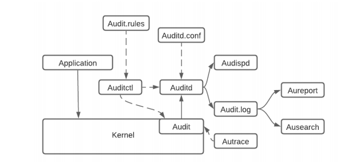
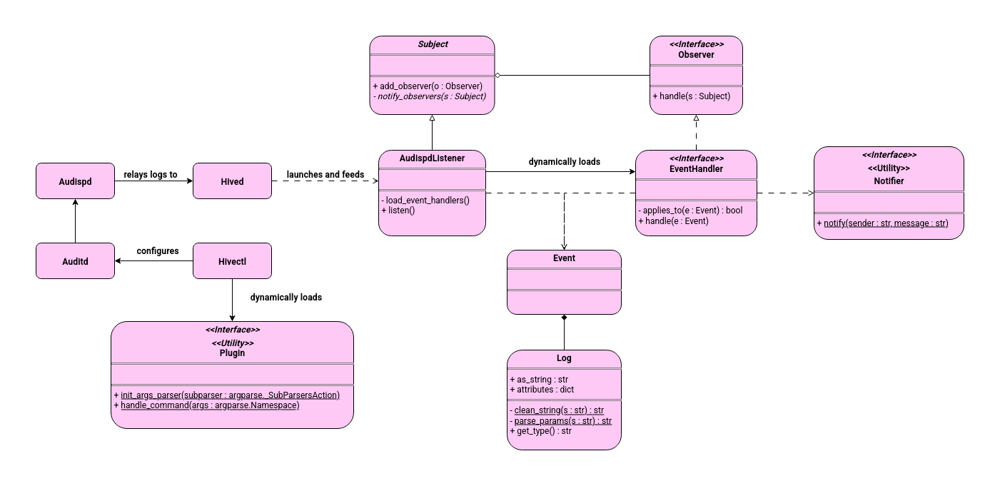

# Hived
Hived is a extensible tool built on top of Auditd that helps to setup honeypots on your linux machines.
It provides an extension/plugin API, to add custom features.

## Base features
Honeypot files/directories

## Installation
## Usage
[Coming soon]

## Context
The Linux Audit Framework records various system calls and logs them.
The Auditd daemon sends logs to either the `audit.log` file or Audispd.
The latter feeds those logs to registered plugins. This is where Hived comes in.
It forwards those events to **event handlers** that analyze them and act accordingly.
They could send email notifications to sysadmins, or even take proper action to eliminate a threat.
If it can be programmed, it can be done. That is the goal of Hived: Intrusion Detection and Prevention (IPS/IDS).

Other more fun idea of Hived usage: perhaps a tool to put in place in a CTF box to add more challenge?
What if, when the player does certain actions like accessing an honey pot file, the box would harden its security?
Or cut the connection and reset progress? That'd be interesting! :p

[(source)](https://www.researchgate.net/figure/Linux-Auditd-Architecture_fig2_355181208)


## Interesting resources to better understand the Audit Framework
[Red Hat Documentation - Chapter 7. System Auditing](https://docs.redhat.com/en/documentation/red_hat_enterprise_linux/7/html/security_guide/chap-system_auditing)

## Where do events come from?
The Audit Framework uses rules to know which events it should record, and in what way.
You can also associate keys to rules to better identify events that were recorded thanks to the rules.
Here is an example:

`-a always,exit -F arch=b64 -F dir=/home/arianne/honeypot_folder -F perm=rw -F key=honeypot_file`

You can better understand rules with [this incredible article from Red Hat](https://docs.redhat.com/en/documentation/red_hat_enterprise_linux/7/html/security_guide/sec-Defining_Audit_Rules_and_Controls#sec-Defining_Audit_Rules_with_auditctl).

> [!TIP]
> Hivectl plugins come into action here: they can add their own rules.

## Understanding events and logs
Events are composed of logically tied logs. Those logs are strings composed of key/value
entries separated by white spaces. Here is an example:

`type=CWD msg=audit(1752022100.814:201): cwd="/home/arianne"`

As you can see, logs have different types. The most important ones are `SYSCALL` and `EOE`.
SYSCALL usually marks the start of an event, while EOE (End Of Event) marks,
you guessed it, the end of and event. That is how we can identify all the logs tied to a specific event.
A full event would look like this:

```text
type=SYSCALL msg=audit(1752022100.814:201): arch=c000003e syscall=257 success=yes exit=3 a0=ffffff9c a1=563b51ddd6e0 a2=90800 a3=0 items=1 ppid=10720 pid=11390 auid=1000 uid=1000 gid=1000 euid=1000 suid=1000 fsuid=1000 egid=1000 sgid=1000 fsgid=1000 tty=pts1 ses=1 comm="ls" exe="/usr/bin/ls" key="filesystem"ARCH=x86_64 SYSCALL=openat AUID="arianne" UID="arianne" GID="arianne" EUID="arianne" SUID="arianne" FSUID="arianne" EGID="arianne" SGID="arianne" FSGID="arianne"
type=CWD msg=audit(1752022100.814:201): cwd="/home/arianne"
type=PATH msg=audit(1752022100.814:201): item=0 name="honeypot_folder/" inode=10885709 dev=103:06 mode=040755 ouid=1000 ogid=1000 rdev=00:00 nametype=NORMAL cap_fp=0 cap_fi=0 cap_fe=0 cap_fver=0 cap_frootid=0OUID="arianne" OGID="arianne"
type=PROCTITLE msg=audit(1752022100.814:201): proctitle=6C73002D2D636F6C6F723D6175746F00686F6E6579706F745F666F6C6465722F
type=EOE msg=audit(1752022100.814:201):
```

This is an event that was triggered by accessing a folder using the `ls` command.

> [!TIP]
> the PROCTITLE log gives the command that was executed in an HEX format.
> You can replace '00' with '20' to have valid white spaces.


## Plugin/Extension API
There are three ways of adding your own functionalities: event handlers, notifiers and hivectl plugins.
You should refer to the UML class diagram to better understand this section.
### Event handlers
These are loaded dynamically by AudispListener from the `handlers` folder.
The Observer design pattern is used to feed every new event received by AudispListener
to all event handlers. Two methods are required for an event handler to function:
applies_to(e : Event) and handle(e : Event)

### Notifiers

### Hivectl plugins

## Documentation
### UML representation
